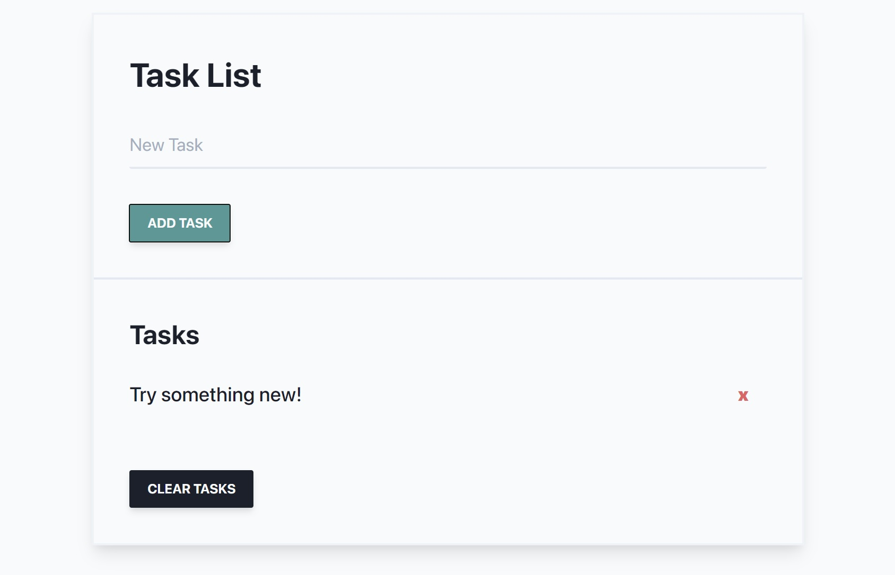

## Task List in Vanilla JavaScript

#### About

Persistent data on browser refresh with Local Storage. Clean UI made with [Tailwindcss](https://tailwindcss.com/). Ultra light-weight app created without using JavaScript framework.

See the live project [here](https://astridlyre.github.io/task-list/).

#### Features

You can add new tasks, select if the task is important or not, and you can filter the tasks shown by importance or by text. You can also clear all the tasks or delete them individually. You can also edit notes individually.
